# originbot
OriginBot智能机器人开源套件


## 软件架构

- originbot_base：机器人底盘驱动
- originbot_bringup：机器人启动相关的脚本和文件
- originbot_description：机器人模型及加载脚本
- originbot_navigation：机器人建图与导航相关的脚本和配置文件
- body_tracking：机器人人体跟随功能包
- gesture_control：机器人手势控制功能包


## 系统配置

### 安装系统镜像

#### 使用配置好的系统镜像

使用win32disk或者rufus工具，将提供的sd卡镜像文件烧写到配套的SD卡中。


#### 纯净系统的完整配置过程
1. 安装Ubuntu系统（推荐使用服务器server版本）：
https://developer.horizon.ai/api/v1/fileData/documents_pi/Quick_Start/Quick_Start.html#id3


2. 配置网络：
https://developer.horizon.ai/api/v1/fileData/documents_pi/System_Configuration/System_Configuration.html#id3

3. 更新系统：
https://developer.horizon.ai/api/v1/fileData/documents_pi/System_Configuration/System_Configuration.html#id2

3. 安装TogetherROS：
https://developer.horizon.ai/api/v1/fileData/TogetherROS/quick_start/install_tros.html

4. 安装ROS2：
https://hhp.guyuehome.com/hhp/2.3_TogetherROS%E7%B3%BB%E7%BB%9F%E9%85%8D%E7%BD%AE/#ros2
    - 如遇到网络连接问，可参考：https://blog.51cto.com/u_11440114/5102048、https://guyuehome.com/37844

5. 安装功能包：
```bash
$ sudo apt install python3-colcon-common-extensions # ROS2编译器
$ sudo apt install git                              # 安装git工具
$ sudo apt install ros-foxy-navigation              # 安装导航功能包
$ sudo apt install ros-foxy-nav2-bringup            # 安装导航功能包
$ sudo apt install ros-foxy-slam-toolbox            # 安装slam-toolbox
$ sudo apt install ros-foxy-cartographer-ros        # 安装cartographer
$ sudo apt install ros-foxy-teleop-twist-keyboard   # 安装键盘控制节点
$ sudo apt install ros-foxy-robot-localization      # 安装定位功能包
```

如遇到类似如下问题：
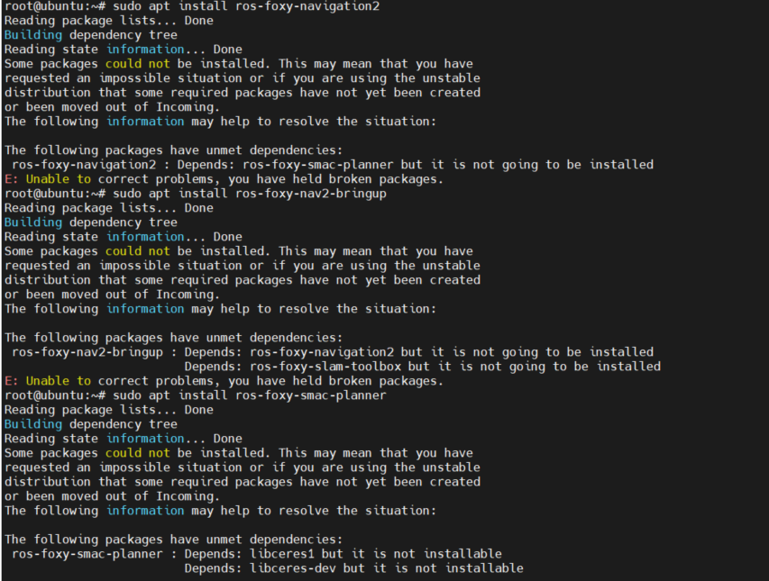

需要修改一下软件源的配置：
```bash
$ sudo vi /etc/apt/sources.list
```

将下边被注释掉的几个软件源打开：
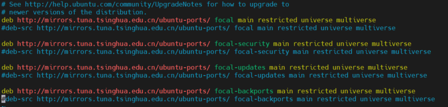

修改好重新update再安装即可。


6. 配置软链接：
```bash
$ cd /opt/tros 
## 使用/opt/tros目录下的create_soft_link.py创建ROS package至TogetherROS的软链接 
$ python3 create_soft_link.py --foxy /opt/ros/foxy/ --tros /opt/tros 
```

7. 在userdata（或root）文件夹下，创建dev_ws/src工作空间:
```bash
$ mkdir -p /userdata/dev_ws/src
```

8. 下载代码到src中：
```bash
$ cd /userdata/dev_ws/src
$ git clone https://gitee.com/guyuehome/originbot.git
```

9. 安装YDLidar的SDK：
```bash
# 安装工具库
$ sudo apt install cmake pkg-config
$ sudo apt-get install python swig
$ sudo apt-get install python3-pip

# 编译ydlidar SDK
$ cd /userdata
$ git clone https://github.com/YDLIDAR/YDLidar-SDK.git
$ cd YDLidar-SDK
$ mkdir build
$ cd build
$ cmake ..
$ make -j2
$ sudo make install

# 安装python版本的SDK
$ cd ..
$ pip install .
```

10. 在工作空间中编译代码：
```bash
$ cd /userdata/dev_ws
$ source /opt/tros/setup.bash
$ colcon build
```

11. 配置串口的端口号
```bash
$ chmod 0777 /userdata/dev_ws/src/originbot/ydlidar_ros2_driver/startup/*
$ sudo sh /userdata/dev_ws/src/originbot/ydlidar_ros2_driver/startup/initenv.sh
```

12. 添加环境变量到/root/.bashrc（和登录的用户有关系，使用其他用户登录的话，就修改对应用户文件夹下的.bashrc）
```bash
$ vi /root/.bashrc

# 在文件末尾添加如下内容：
source /opt/tros/setup.bash
source /userdata/dev_ws/install/local_setup.bash
```

13. 为保证后续使用的顺畅，可以配置1GB的SWAP空间：
```bash
$ sudo mkdir -p /swapfile 
$ cd /swapfile 
$ sudo dd if=/dev/zero of=swap bs=1M count=1024 
$ sudo chmod 0600 swap 
$ sudo mkswap -f swap 
$ sudo swapon swap 
$ free
```

操作效果如下：
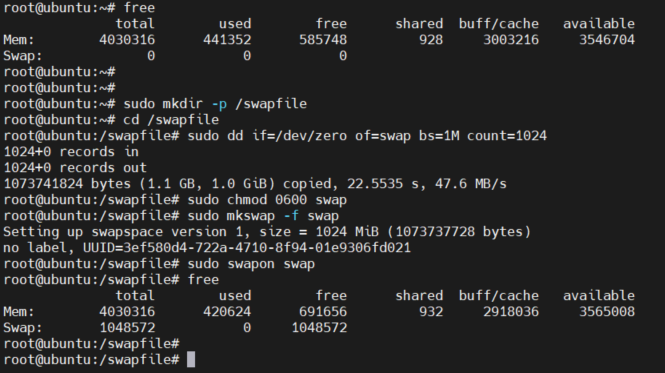

14. 修改系统中调用的摄像头，改为对应的使用版本


15. 重启系统，确保以上配置生效


### 系统镜像备份方法


```bash
$ sudo fdisk -l
$ sudo dd if=/dev/sdb conv=sync,noerror bs=16M | gzip -c > backup.img.gz
```


## 操作说明


### 查看机器人状态
```bash
$ ros2 topic echo /originbot_status
```
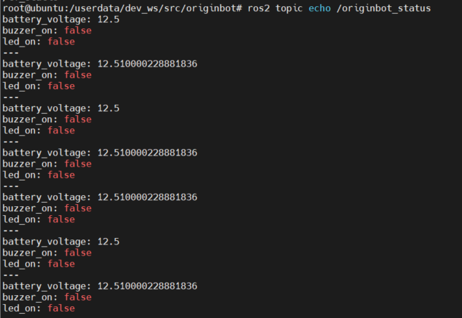


### 控制板载蜂鸣器

```bash
$ ros2 service call /originbot_buzzer originbot_msgs/srv/OriginbotBuzzer "'on': true"     ## 打开蜂鸣器
$ ros2 service call /originbot_buzzer originbot_msgs/srv/OriginbotBuzzer "'on': false"    ## 关闭蜂鸣器
```
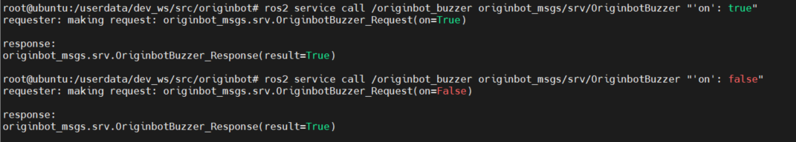


### 控制板载LED灯

```bash
$ ros2 service call /originbot_led originbot_msgs/srv/OriginbotLed "'on': true"      ## 打开LED
$ ros2 service call /originbot_led originbot_msgs/srv/OriginbotLed "'on': false"     ## 关闭LED
```


### 设置电机PID参数

```bash
$ ros2 service call /originbot_pid originbot_msgs/srv/OriginbotPID "{p: 0.1, i: 0.0, d: 4.0}" 
```


### 查看雷达可视化信息

#### 机器人端

```bash
$ ros2 launch originbot_bringup originbot_lidar.launch.py
```


#### pc端终端

```bash
$ ros2 run rviz2 rviz2
```


添加Laserscan之后，配置订阅的话题，即可看到可视化的雷达信息：
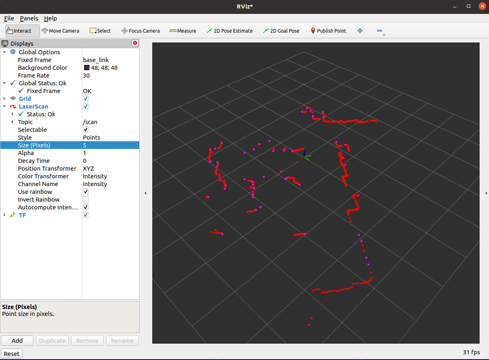


### 查看IMU可视化数据

#### 机器人端

```bash
$ ros2 launch originbot_bringup originbot.launch.py
```


#### PC端

```bash
$ ros2 run rviz2 rviz2
```


添加IMU之后，配置订阅的话题，即可看到可视化的IMU信息：
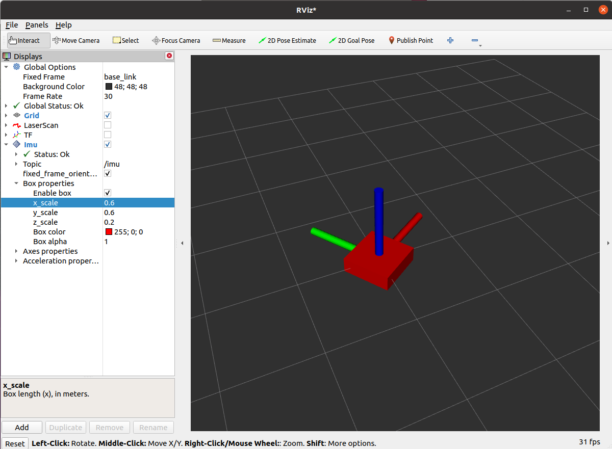


如果Rviz中找不到imu插件，需要进行安装：

```bash
$ sudo apt install ros-foxy-rviz-imu-plugin
```


### 键盘遥控

#### 机器人端

第一个终端：

```bash
$ ros2 launch originbot_bringup originbot.launch.py
```

第二个终端（在PC端运行也可以）：

```bash
$ ros2 run teleop_twist_keyboard teleop_twist_keyboard
```


#### PC端

如果想要查看机器人的动态运动效果，可以在PC端打开Rviz查看：

```bash
$ ros2 run rviz2 rviz2
```

Fixed Frame选择odom，添加tf显示，即可看到：
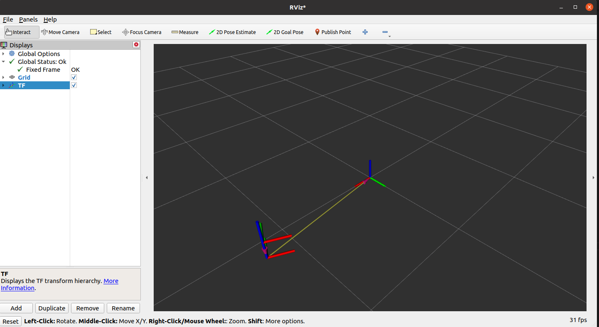


### 机器人里程计校准

#### 机器人端

第一个终端：

```bash
$ ros2 launch originbot_bringup originbot.launch.py
```

第二个终端（在PC端运行也可以）：

```bash
$ ros2 run teleop_twist_keyboard teleop_twist_keyboard
```


#### PC端

如果想要查看机器人的动态运动效果，可以在PC端打开Rviz查看：

```bash
$ ros2 run rviz2 rviz2
```

Fixed Frame选择odom，添加tf显示，即可看到：


### SLAM地图构建

#### 机器人端

第一个终端：

```bash
$ ros2 launch originbot_bringup originbot_lidar.launch.py
```

第二个终端：

```bash
$ ros2 launch originbot_navigation cartographer.launch.py
```

第三个终端（在PC端运行也可以）：

```bash
$ ros2 run teleop_twist_keyboard teleop_twist_keyboard
```

保存地图：
```bash
$ ros2 run nav2_map_server map_saver_cli -f my_map --ros-args -p save_map_timeout:=10000
```


#### PC端

```bash
$ ros2 run rviz2 rviz2
```
添加map、tf、laserscan等显示插件后，可以看到slam的过程


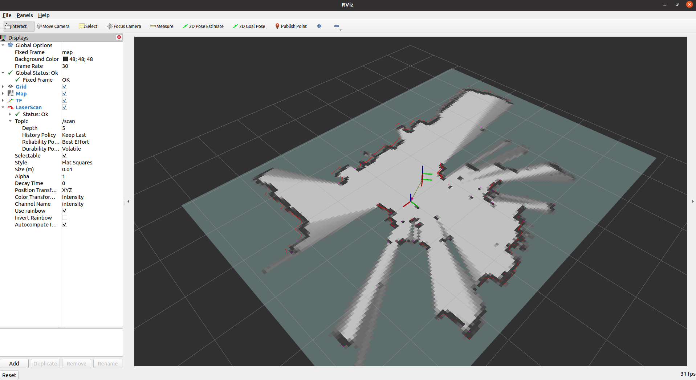


### 自主导航


#### 机器人端

第一个终端：

```bash
$ ros2 launch originbot_bringup originbot_lidar.launch.py
```

第二个终端：

```bash
$ ros2 launch originbot_navigation nav_bringup.launch.py
```
启动成功后，会在终端中看到不断输出的信息，这是因为没有设置机器人初始位姿的缘故，后续启动Rviz之后会进行设置，暂时可以忽略。


#### PC端

```bash
$ ros2 run rviz2 rviz2
```

在打开的Rviz中配置好显示项目，点击工具栏中的初始状态估计按钮，在地图中选择机器人的初始位姿，此时此前终端中的警告也会停止，然后点击目标位置选择的按钮，在地图上选择导航目标点，即可开始自主导航。

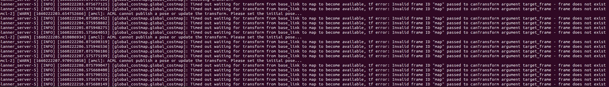

注意：如果在配置好的Rviz中没看到静态地图，可以尝试关闭运行导航的终端，重新打开Rviz之后，再启动Rivz。


### 人体跟踪

#### 机器人端

第一个终端：

```bash
$ ros2 launch originbot_bringup originbot.launch.py
```

第二个终端：

```bash
$ source /opt/tros/setup.bash

# 从TogetherROS的安装路径中拷贝出运行示例需要的配置文件
$ cd /userdata/dev_ws
$ cp -r /opt/tros/lib/mono2d_body_detection/config/ .

#启动launch文件
$ ros2 launch body_tracking hobot_body_tracking_without_gesture.launch.py 
```

#### PC端

打开浏览器，访问机器人的ip地址，即可看到视觉识别的实时效果。
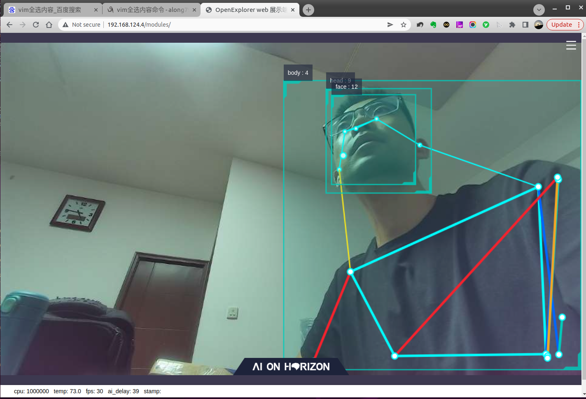


### 手势识别

#### 机器人端

第一个终端：

```bash
$ ros2 launch originbot_bringup originbot.launch.py
```

第二个终端：

```bash
# 配置TogetherROS环境
$ source /opt/tros/setup.bash

# 从TogetherROS的安装路径中拷贝出运行示例需要的配置文件
$ cd /userdata/dev_ws
$ cp -r /opt/tros/lib/mono2d_body_detection/config/ .
$ cp -r /opt/tros/lib/hand_lmk_detection/config/ .
$ cp -r /opt/tros/lib/hand_gesture_detection/config/ .

#启动launch文件
$ ros2 launch gesture_control hobot_gesture_control.launch.py
```

### PC端

打开浏览器，访问机器人的ip地址，即可看到视觉识别的实时效果。


## 常见问题
1. 当电池电压较低时，会影响雷达供电，导致雷达频率降低，请及时充电；


## 参与贡献

1.  Fork 本仓库
2.  新建 Feat_xxx 分支
3.  提交代码
4.  新建 Pull Request
