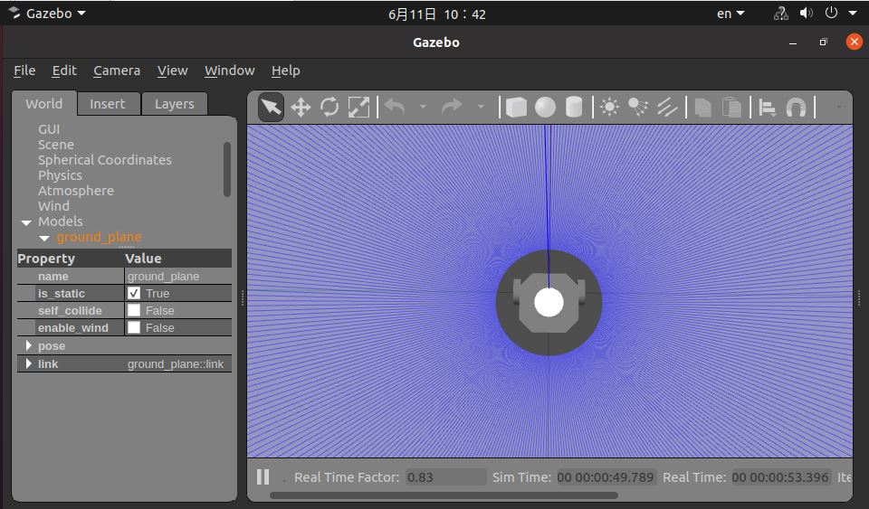

English| [简体中文](./README_cn.md)

# Feature introduction

Detect and track human targets visually, and generate motion control commands to control the robot to automatically follow the target's movement. This feature supports two modes of experience: physical robot and Gazebo simulation.


# Physical robot

## Bill of materials

The following robots are all compatible with RDK X3

| Robot Name           | Manufacturer | Reference Link                                               |
| :------------------  | --------    | ------------------------------------------------------------ |
| OriginBot Smart Robot| Guyueju     | [Click here to jump](https://www.originbot.org/)             |
| X3 Pie Robot         | Lunqu Technology | [Click here to jump](https://item.taobao.com/item.htm?spm=a230r.1.14.17.55e556912LPGGx&id=676436236906&ns=1&abbucket=12#detail) |
| Tracked Smart Car    | Weixue Electronics | [Click here to jump](https://detail.tmall.com/item.htm?abbucket=9&id=696078152772&rn=4d81bea40d392509d4a5153fb2c65a35&spm=a1z10.5-b-s.w4011-22714387486.159.12d33742lJtqRk) |
| RDK X3 Robot         | Yabo Intelligent | [Click here to jump](https://detail.tmall.com/item.htm?id=726857243156&scene=taobao_shop&spm=a1z10.1-b-s.w5003-22651379998.21.421044e12Yqrjm) |

## Instructions

### Preparations

1. The robot has a movement chassis, camera, and RDK kit, and the hardware is connected and tested;
2. ROS low-level driver is available, the robot can receive "/cmd_vel" commands for motion, and move correctly according to the commands.

### Robot assembly
The following operating process is based on OriginBot, and the usage method for other robots meeting the conditions is similar. Refer to the robot's official website [instructions](https://www.originbot.org/guide/quick_guide/), complete the assembly of the robot's hardware, image writing, and example operation, confirming that the basic functions of the robot can run smoothly.

### Install packages
**1. Refer to [OriginBot instructions](https://github.com/nodehubs/originbot_minimal/blob/develop/README.md) to complete the installation of Originbit basic functions**

**2. Install human tracking package**

After starting the robot, connect to the robot through terminal or VNC, click the "One-Click Deployment" button on this page's upper right corner, copy and run the following command on RDK system to install the human tracking-related nodes.

tros foxy:
```bash
sudo apt update
sudo apt install -y tros-body-tracking
```

tros humble:
```bash
sudo apt update
sudo apt install -y tros-humble-body-tracking
```

### Run human tracking function

**1. Start the robot chassis**

Start the robot, for example, the startup command for OriginBot is as follows:

tros foxy:
```bash
source /opt/tros/setup.bash
ros2 launch originbot_base robot.launch.py 
```

tros humble:
```bash
source /opt/tros/humble/setup.bash
ros2 launch originbot_base robot.launch.py
```

**2. Start Human Body Tracking**

Start a new terminal and initiate human body tracking function with the following commands:

tros foxy:
```bash
# Copy the model of body tracking
cp -r /opt/tros/${TROS_DISTRO}/lib/mono2d_body_detection/config/ .

# Source Node
source /opt/tros/setup.bash

# Configure the camera interface being used, if using a USB camera, change "mipi" to "usb"
export CAM_TYPE=mipi

# Run human body tracking
ros2 launch body_tracking body_tracking_without_gesture.launch.py 
```

tros humble:
```bash
# Source Node
source /opt/tros/humble/setup.bash

# Copy the model of body tracking
cp -r /opt/tros/${TROS_DISTRO}/lib/mono2d_body_detection/config/ .

# Configure the camera interface being used, if using a USB camera, change "mipi" to "usb"
export CAM_TYPE=mipi

# Run human body tracking
ros2 launch body_tracking body_tracking_without_gesture.launch.py
```

After successful startup, stand in front of the robot's camera. Move your body slowly to allow the robot to recognize the entire body. You will see the robot start to follow the movement of the person. If there are multiple bodies in the field of view, the body with the largest occupied area in the current field of view will be the tracking target, continuously following the movement.


**3. View Visual Recognition Effects**

Open the browser on the same networked computer, visit the IP address of the robot, and you will see real-time visual recognition effects:


# Gazebo Simulation

Gazebo simulation is suitable for developers who have the RDK X3 but do not have the physical robot to experience the human body tracking function.

## Bill of Materials

| Robot Name       | Manufacturer | Reference Link                                               |
| :--------------- | ------------ | ------------------------------------------------------------ |
| RDK X3           | Multiple     | [Click to jump](https://developer.horizon.ai/sunrise)        |

## Usage

### Preparation

Before experiencing it, you need to meet the following basic conditions:

- Developers have physical RDK kits and accompanying cameras.
- The PC has completed the installation of ROS Gazebo and Turtlebot robot-related function packages.
- Ensure that the PC being used and the RDK are in the same network.

### Install PackagesOnce the RDK X3 is started, connect to the robot via terminal or VNC, click the "One-click Deployment" button on [NodeHub](http://it-dev.horizon.ai/nodehubDetail/167289845913411076) at the top right, and copy and run the following commands on the RDK system to install the related Nodes for human body tracking.

tros foxy:
```bash
sudo apt update
sudo apt install -y tros-test-body-tracking
```

tros humble:
```bash
sudo apt update
sudo apt install -y tros-humble-test-body-tracking
```

### Run Human Body Tracking Functionality

**1. Start the Simulation Environment and Robot**

On the PC side's Ubuntu terminal, use the following commands to start Gazebo and load the robot model:

foxy:
```bash
source /opt/ros/foxy/setup.bash
export TURTLEBOT3_MODEL=burger
ros2 launch turtlebot3_gazebo empty_world.launch.py
```

humble:
```bash
source /opt/ros/humble/setup.bash
export TURTLEBOT3_MODEL=burger
ros2 launch turtlebot3_gazebo empty_world.launch.py
```

After successful startup, the car in the simulation environment looks as follows:




**2. Start Human Body Tracking**

In the RDK system, start a terminal and use the following commands to initiate the human body tracking functionality:


tros foxy:
```bash
# Copy the model for body tracking
cp -r /opt/tros/${TROS_DISTRO}/lib/mono2d_body_detection/config/ .

# Start the Node
source /opt/tros/setup.bash

# Configure the camera interface used, if using a USB camera, change "mipi" to "usb"
export CAM_TYPE=mipi

# Run the human body tracking
ros2 launch body_tracking body_tracking_without_gesture.launch.py
```

tros humble:
```bash
# Start the Node
source /opt/tros/humble/setup.bash

# Copy the model for body tracking
cp -r /opt/tros/${TROS_DISTRO}/lib/mono2d_body_detection/config/ .

# Configure the camera interface used, if using a USB camera, change "mipi" to "usb"
export CAM_TYPE=mipi

# Run the human body tracking
ros2 launch body_tracking body_tracking_without_gesture.launch.py
```

After successful startup, stand in front of the robot camera, let the robot recognize the entire body by slowly moving, and you can see the robot has started to follow the human body movement. If there are multiple human bodies in the field of view, the one occupying the largest area will be selected as the tracking target, continuously following the movement.


**3. View Visual Recognition Results**

Open a web browser on the PC side, access the RDK's IP address, and you can observe real-time visual recognition results:# Advanced Features

## Gesture Wake-Up

This function supports waking up the human body tracking function through gestures. When the wake-up gesture is enabled, the robot will track the person who made the wake-up gesture. It is generally used in scenarios with many people and complex environments to avoid accidental triggering of control functions by enabling the wake-up gesture.

To use this function, modify the following command while running the human body tracking function, with all other operations remaining the same:

tros foxy:
```bash
# Copy the model for body tracking
cp -r /opt/tros/${TROS_DISTRO}/lib/mono2d_body_detection/config/ .
cp -r /opt/tros/${TROS_DISTRO}/lib/hand_lmk_detection/config/ .
cp -r /opt/tros/${TROS_DISTRO}/lib/hand_gesture_detection/config/ .

# Start Node
source /opt/tros/setup.bash

# Configure the camera interface used, if using a USB camera, change "mipi" to "usb"
export CAM_TYPE=mipi

# Run body tracking
ros2 launch body_tracking body_tracking.launch.py 
```

tros humble:
```bash
# Start Node
source /opt/tros/humble/setup.bash

# Copy the model for body tracking
cp -r /opt/tros/${TROS_DISTRO}/lib/mono2d_body_detection/config/ .
cp -r /opt/tros/${TROS_DISTRO}/lib/hand_lmk_detection/config/ .
cp -r /opt/tros/${TROS_DISTRO}/lib/hand_gesture_detection/config/ .

# Configure the camera interface used, if using a USB camera, change "mipi" to "usb"
export CAM_TYPE=mipi

# Run body tracking
ros2 launch body_tracking body_tracking.launch.py
```

Gesture Wake-Up Instructions:

| Illustration                        | Gesture | Wake-Up Description                                            |
| ----------------------------------- | ------- | ------------------------------------------------------------ |
|     | OK      | Wake-Up gesture, activate human body tracking after recognition |
| | Palm    | Cancel tracking gesture, stop human body tracking. After cancellation, the wake-up gesture needs to be used again to select the tracked person |

**Note:**

When making a wake-up or cancellation gesture, raise your hand (hand above the shoulder) to avoid mis-waking up/cancellation due to gesture algorithm errors.

# Interface Description


## Topics

The results of human body recognition and gesture wake-up are published through the [hobot_msgs/ai_msgs/msg/PerceptionTargets](https://github.com/D-Robotics/hobot_msgs/blob/develop/ai_msgs/msg/Target.msg) topic. The detailed definition of this topic is as follows:

```
# Header of the message
std_msgs/Header header

# Frame rate for processing perception results
int16 fps

# Performance statistics, such as recording the inference time for each model
Perf[] perfs

# Collection of perception targets
Target[] targets

# Collection of disappeared targets
Target[] disappeared_targets
```


| Name                          | Message Type                                                | Description                                              |
| ----------------------------- | ----------------------------------------------------------- | -------------------------------------------------------- |
| /cmd_vel                      | geometry_msgs/msg/Twist                                     | Publishes speed commands to control robot movement.       |
| /hobot_mono2d_body_detection  | [hobot_msgs/ai_msgs/msg/PerceptionTargets](hobot_msgs/ai_msgs/msg/PerceptionTargets) | Publishes information about recognized human body targets. |
| /hobot_hand_gesture_detection | [hobot_msgs/ai_msgs/msg/PerceptionTargets](hobot_msgs/ai_msgs/msg/PerceptionTargets) | Publishes information about recognized gesture targets (only appear when gesture wake-up is activated). |
| /hobot_hand_lmk_detection     | [hobot_msgs/ai_msgs/msg/PerceptionTargets](hobot_msgs/ai_msgs/msg/PerceptionTargets) | Publishes information about recognized gesture key points (only appear when gesture wake-up is activated). |


## Parameters

| Parameter Name              | Type        | Description                                                  | Required | Supported Configuration                                      | Default Value                 | Support Dynamic Reconfigure |
| --------------------------- | ----------- | ------------------------------------------------------------ | -------- | ------------------------------------------------------------ | ----------------------------- | --------------------------- |
| track_serial_lost_num_thr   | int         | Threshold of consecutive frames a target can be lost. If exceeded, the target is considered lost. | No       | Unlimited                                                    | 100                           | Yes                         |
| activate_wakeup_gesture     | int         | Whether to enable wake-up gesture.                          | No       | 0/1. 0: Disable, 1: Enable.                                  | 0                             | Yes                         |
| linear_velocity             | float       | Step length for translational motion in meters.              | No       | Unlimited                                                    | 0.1                           | Yes                         |
| angular_velocity            | float       | Step length for rotational motion in radians.                | No       | Unlimited                                                    | 0.5                           | Yes                         |
| twist_pub_topic_name        | std::string | Topic name for publishing Twist type motion control messages. | No       | Configured based on deployment environment. Typically, robots subscribe to /cmd_vel, and ROS2 turtlesim example subscribes to turtle1/cmd_vel. | /cmd_vel                      | No                          |
| ai_msg_sub_topic_name       | std::string | Topic name for subscribing AI messages containing gesture recognition results. | No       | Configured based on deployment environment.                   | /hobot_hand_gesture_detection | No                          |
| img_width                   | int         | Width of image resolution corresponding to detection box.     | No       | Configured based on published image resolution.              | 960                           | Yes                         |
| img_height                  | int         | Height of image resolution corresponding to detection box.    | No       | Configured based on published image resolution.              | 544                           | Yes                         |
| activate_robot_move_thr     | int         | Pixel threshold to activate translational motion. When the distance between the human detection box and the upper boundary is less than this threshold, translational motion is activated. | No       | 0-img_height                                                | 5                             | Yes                         |
| activate_robot_rotate_thr   | int         | Euler angle threshold to activate rotational motion. When the angle between the followed human and the robot is greater than this threshold, rotational motion is activated. | No       | 0-90                                                        | 45                            |                             |


# Introduction

This feature consists of camera image capturing, human body detection and tracking, human following strategy, image encoding and decoding, WEB display end, etc., as shown in the following flowchart:


Upon detecting a human body in the field of view, calculate the angle between the center of the human body detection box and the robot. When the angle exceeds the threshold value (activate_robot_rotate_thr), control the robot to rotate to keep the followed person directly in front of the robot. When the followed person disappears, stop the robot's movement and search for a new person to follow. When the followed person is directly in front of the robot, determine if the top boundary of the human body detection box (the top coordinate of the detection box) exceeds the threshold value (activate_robot_move_thr), then control the robot's movement.

> For a detailed implementation explanation, please refer to the "References".


# References

- Video explaining the implementation principle: [Click here](https://developer.horizon.ai/college/detail/id=98129467158916314)
- OriginBot human following example: [Click here](https://www.originbot.org/application/body_detection/)


# Frequently Asked Questions

**1. When running the startup command on Ubuntu, an error shows `-bash: ros2: command not found`**

This indicates that the ROS2 environment is not set in the current terminal. Execute the following command to configure the environment:

tros foxy:
```
source /opt/tros/setup.bash
```

tros humble:
```
source /opt/tros/humble/setup.bash
```
