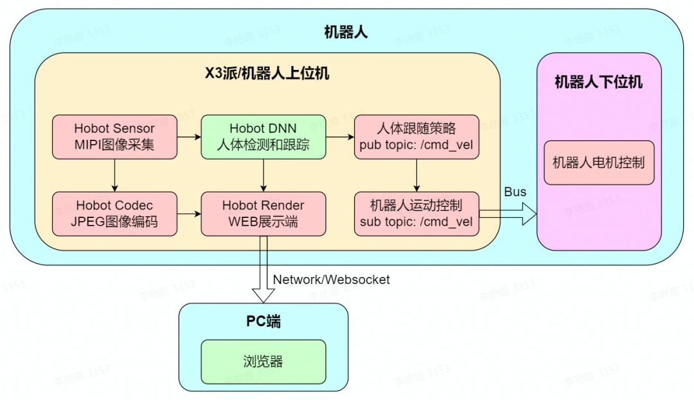

[English](./README.md) | 简体中文

# 功能介绍

通过视觉进行人体目标检测与跟踪，并生成运动控制指令控制机器人自动跟随目标运动。该功能支持机器人实物和Gazebo仿真两种体验方式。


# 机器人实物

## 物料清单

以下机器人均已适配RDK X3

| 机器人名称          | 生产厂家 | 参考链接                                                     |
| :------------------ | -------- | ------------------------------------------------------------ |
| OriginBot智能机器人 | 古月居   | [点击跳转](https://www.originbot.org/)                       |
| X3派机器人          | 轮趣科技 | [点击跳转](https://item.taobao.com/item.htm?spm=a230r.1.14.17.55e556912LPGGx&id=676436236906&ns=1&abbucket=12#detail) |
| 履带智能车          | 微雪电子 | [点击跳转](https://detail.tmall.com/item.htm?abbucket=9&id=696078152772&rn=4d81bea40d392509d4a5153fb2c65a35&spm=a1z10.5-b-s.w4011-22714387486.159.12d33742lJtqRk) |
| RDK X3 Robot        | 亚博智能 | [点击跳转](https://detail.tmall.com/item.htm?id=726857243156&scene=taobao_shop&spm=a1z10.1-b-s.w5003-22651379998.21.421044e12Yqrjm) |

## 使用方法

### 准备工作

1. 机器人具备运动底盘、相机及RDK套件，硬件已经连接并测试完毕；
2. 已有ROS底层驱动，机器人可接收“/cmd_vel”指令运动，并根据指令正确运动。

### 机器人组装
以下操作过程以OriginBot为例，满足条件的其他机器人使用方法类似。参考机器人官网的[使用指引](https://www.originbot.org/guide/quick_guide/)，完成机器人的硬件组装、镜像烧写及示例运行，确认机器人的基础功能可以顺利运行。

### 安装功能包
**1.参考[OriginBot说明](https://github.com/nodehubs/originbot_minimal/blob/develop/README.md)，完成Originbit基础功能安装**

**2.安装人体跟随功能包**

启动机器人后，通过终端或者VNC连接机器人，点击本页面右上方的“一键部署”按钮，复制如下命令在RDK的系统上运行，完成人体跟随相关Node的安装。

tros foxy 版本
```bash
sudo apt update
sudo apt install -y tros-body-tracking
```

tros humble 版本
```bash
sudo apt update
sudo apt install -y tros-humble-body-tracking
```

### 运行人体跟随功能

**1.启动机器人底盘**

启动机器人，如OriginBot的启动命令如下：

tros foxy 版本
```bash
source /opt/tros/setup.bash
ros2 launch originbot_base robot.launch.py 
```

tros humble 版本
```bash
source /opt/tros/humble/setup.bash
ros2 launch originbot_base robot.launch.py
```

**2.启动人体跟随**

启动一个新的终端，通过如下指令启动人体跟随功能：

tros foxy 版本
```bash
# 拷贝人体跟随的模型
cp -r /opt/tros/${TROS_DISTRO}/lib/mono2d_body_detection/config/ .

#启动Node
source /opt/tros/setup.bash

# 配置使用的相机接口，如使用usb相机，"mipi"改为"usb"
export CAM_TYPE=mipi

# 运行人体跟随
ros2 launch body_tracking body_tracking_without_gesture.launch.py 
```

tros numble 版本
```bash
#启动Node
source /opt/tros/humble/setup.bash

# 拷贝人体跟随的模型
cp -r /opt/tros/${TROS_DISTRO}/lib/mono2d_body_detection/config/ .

# 配置使用的相机接口，如使用usb相机，"mipi"改为"usb"
export CAM_TYPE=mipi

# 运行人体跟随
ros2 launch body_tracking body_tracking_without_gesture.launch.py
```

启动成功后，站在机器人摄像头前，需要让机器人识别到整个身体，慢慢移动身体，可以看到机器人已经开始跟随人体运动。若视野中存在多个人体，则以当前占据视野面积最大的人体作为跟踪目标，持续跟随移动。


**3.查看视觉识别效果**

打开同一网络电脑的浏览器，访问机器人的IP地址，即可看到视觉识别的实时效果：


# Gazebo仿真

Gazebo仿真适用于持有RDK X3但没有机器人实物的开发者体验人体跟随功能。

## 物料清单

| 机器人名称          | 生产厂家 | 参考链接                                                     |
| :------------------ | -------- | ------------------------------------------------------------ |
| RDK X3             | 多厂家 | [点击跳转](https://developer.horizon.ai/sunrise) |

## 使用方法

### 准备工作

在体验之前，需要具备以下基本条件：

- 开发者有RDK套件实物，及配套的相机
- PC电脑端已经完成ROS Gazebo及Turtlebot机器人相关功能包安装
- 确保使用的PC与RDK处于统一网络中

### 安装功能包

启动RDK X3后，通过终端或者VNC连接机器人，点击[NodeHub](http://it-dev.horizon.ai/nodehubDetail/167289845913411076)右上方的“一键部署”按钮，复制如下命令在RDK的系统上运行，完成人体跟随相关Node的安装。

tros foxy 版本
```bash
sudo apt update
sudo apt install -y tros-test-body-tracking
```

tros humble 版本
```bash
sudo apt update
sudo apt install -y tros-humble-test-body-tracking
```

### 运行人体跟随功能

**1.启动仿真环境及机器人**

在PC端Ubuntu的终端中使用如下命令启动Gazebo，并加载机器人模型：

foxy 版本
```bash
source /opt/ros/foxy/setup.bash
export TURTLEBOT3_MODEL=burger
ros2 launch turtlebot3_gazebo empty_world.launch.py
```

humble 版本
```bash
source /opt/ros/humble/setup.bash
export TURTLEBOT3_MODEL=burger
ros2 launch turtlebot3_gazebo empty_world.launch.py
```

启动成功后，仿真环境中小车效果如下：


**2.启动人体跟随**

在RDK的系统中，启动终端，通过如下指令启动人体跟随功能：

tros foxy 版本
```bash
# 拷贝人体跟随的模型
cp -r /opt/tros/${TROS_DISTRO}/lib/mono2d_body_detection/config/ .

#启动Node
source /opt/tros/setup.bash

# 配置使用的相机接口，如使用usb相机，"mipi"改为"usb"
export CAM_TYPE=mipi

# 运行人体跟随
ros2 launch body_tracking body_tracking_without_gesture.launch.py 
```

tros humble 版本
```bash
#启动Node
source /opt/tros/humble/setup.bash

# 拷贝人体跟随的模型
cp -r /opt/tros/${TROS_DISTRO}/lib/mono2d_body_detection/config/ .

# 配置使用的相机接口，如使用usb相机，"mipi"改为"usb"
export CAM_TYPE=mipi

# 运行人体跟随
ros2 launch body_tracking body_tracking_without_gesture.launch.py
```

启动成功后，站在机器人摄像头前，需要让机器人识别到整个身体，慢慢移动身体，可以看到机器人已经开始跟随人体运动。若视野中存在多个人体，则以当前占据视野面积最大的人体作为跟踪目标，持续跟随移动。


**3.查看视觉识别效果**

打开PC端的浏览器，访问RDK的IP地址，即可看到视觉识别的实时效果：


# 进阶功能

## 手势唤醒

本功能支持通过手势唤醒人体跟随功能，当启用唤醒手势时，机器人会跟随做了唤醒手势的人体。一般用于人较多，环境复杂的场景，通过启用唤醒手势避免误触发控制功能。

如需使用该功能，在运行人体跟随功能时，修改为如下指令，其他操作不变：

tros foxy 版本
```bash
# 拷贝人体跟随的模型
cp -r /opt/tros/${TROS_DISTRO}/lib/mono2d_body_detection/config/ .
cp -r /opt/tros/${TROS_DISTRO}/lib/hand_lmk_detection/config/ .
cp -r /opt/tros/${TROS_DISTRO}/lib/hand_gesture_detection/config/ .

#启动Node
source /opt/tros/setup.bash

# 配置使用的相机接口，如使用usb相机，"mipi"改为"usb"
export CAM_TYPE=mipi

# 运行人体跟随
ros2 launch body_tracking body_tracking.launch.py 
```

tros humble 版本
```bash
#启动Node
source /opt/tros/humble/setup.bash

# 拷贝人体跟随的模型
cp -r /opt/tros/${TROS_DISTRO}/lib/mono2d_body_detection/config/ .
cp -r /opt/tros/${TROS_DISTRO}/lib/hand_lmk_detection/config/ .
cp -r /opt/tros/${TROS_DISTRO}/lib/hand_gesture_detection/config/ .

# 配置使用的相机接口，如使用usb相机，"mipi"改为"usb"
export CAM_TYPE=mipi

# 运行人体跟随
ros2 launch body_tracking body_tracking.launch.py
```

手势唤醒说明：

| 图示                                 | 手势 | 唤醒说明                                                     |
| ------------------------------------ | ---- | ------------------------------------------------------------ |
|      | OK   | 唤醒跟随手势，识别之后启动人体跟随功能                       |
|  | Palm | 取消跟随手势，停止人体跟随功能，取消后需要重新使用唤醒手势选择跟随人体 |


**注意：**

做唤醒或取消手势时，需要举起手（人手在人肩部以上）做手势，避免手势算法误报导致误唤醒/取消。 

# 接口说明


## 话题

人体识别和手势唤醒的结果都通过[hobot_msgs/ai_msgs/msg/PerceptionTargets](https://github.com/D-Robotics/hobot_msgs/blob/develop/ai_msgs/msg/Target.msg)话题发布，该话题的详细定义如下：

```
# 消息头
std_msgs/Header header

# 感知结果的处理帧率
int16 fps

# 性能统计信息，比如记录每个模型推理的耗时
Perf[] perfs

# 感知目标集合
Target[] targets

# 消失目标集合
Target[] disappeared_targets
```


| 名称                          | 消息类型                                                     | 说明                                                   |
| ----------------------------- | ------------------------------------------------------------ | ------------------------------------------------------ |
| /cmd_vel                      | geometry_msgs/msg/Twist                                      | 发布控制机器人移动的速度指令                           |
| /hobot_mono2d_body_detection  | [hobot_msgs/ai_msgs/msg/PerceptionTargets](hobot_msgs/ai_msgs/msg/PerceptionTargets) | 发布识别到的人体目标信息                               |
| /hobot_hand_gesture_detection | [hobot_msgs/ai_msgs/msg/PerceptionTargets](hobot_msgs/ai_msgs/msg/PerceptionTargets) | 发布识别到的手势目标信息（开启手势唤醒之后才会出现）   |
| /hobot_hand_lmk_detection     | [hobot_msgs/ai_msgs/msg/PerceptionTargets](hobot_msgs/ai_msgs/msg/PerceptionTargets) | 发布识别到的手势关键点信息（开启手势唤醒之后才会出现） |


## 参数

| 参数名                    | 类型        | 说明                                                         | 是否必须 | 支持的配置                                                   | 默认值                        | 是否支持运行时动态配置 |
| ------------------------- | ----------- | ------------------------------------------------------------ | -------- | ------------------------------------------------------------ | ----------------------------- | ---------------------- |
| track_serial_lost_num_thr | int         | 目标连续消失帧数阈值。超过此阈值认为目标消失。               | 否       | 无限制                                                       | 100                           | 是                     |
| activate_wakeup_gesture   | int         | 是否启用唤醒手势。                                           | 否       | 0/1。0：不启用，1：启用。                                    | 0                             | 是                     |
| linear_velocity      | float       | 平移运动的步长，单位米。                                     | 否       | 无限制                                                       | 0.1                           | 是                     |
| angular_velocity     | float       | 旋转运动的步长，单位弧度。                                   | 否       | 无限制                                                       | 0.5                           | 是                     |
| twist_pub_topic_name      | std::string | 发布Twist类型的运动控制消息的topic名                         | 否       | 根据实际部署环境配置。一般机器人订阅的topic为/cmd_vel，ROS2 turtlesim示例订阅的topic为turtle1/cmd_vel。 | /cmd_vel                      | 否                     |
| ai_msg_sub_topic_name     | std::string | 订阅包含手势识别结果的AI消息的topic名                        | 否       | 根据实际部署环境配置                                         | /hobot_hand_gesture_detection | 否                     |
| img_width                 | int         | 检测框对应的图片分辨率的宽度                                 | 否       | 根据发布的图片分辨率配置                                     | 960                           | 是                     |
| img_height                | int         | 检测框对应的图片分辨率的高度                                 | 否       | 根据发布的图片分辨率配置                                     | 544                           | 是                     |
| activate_robot_move_thr   | int         | 激活平移运动的像素阈值。当人体检测框距离上边界的像素小于此阈值时激活平移运动。 | 否       | 0-img_height                                                 | 5                             | 是                     |
| activate_robot_rotate_thr | int         | 激活旋转运动的欧拉角度，当被跟随人体和机器人之间的角度大于此阈值时激活旋转运动。 | 否       | 0-90                                                         | 45                            |                        |


# 原理简介

该功能由相机图像采集、人体检测和跟踪、人体跟随策略、图像编解码、WEB展示端等部分组成，流程如下图：



在视野中识别到人体后，判断人体检测框中心点和机器人之间的角度，角度超过阈值（activate_robot_rotate_thr）时，控制机器人旋转，保持被跟随人体在机器人正前方。当被跟随人体消失时，停止机器人运动，并寻找新的被跟随人体。当跟随人体在机器人正前方时，判断人体检测框上边界（检测框的top坐标），超过阈值（activate_robot_move_thr）时，控制机器人运动。

> 详细实现原理请见“参考资料”。


# 参考资料

- 实现原理讲解视频：[点击跳转](https://developer.horizon.ai/college/detail/id=98129467158916314)
- OriginBot人体跟随示例：[点击跳转](https://www.originbot.org/application/body_detection/)


# 常见问题

**1、Ubuntu下运行启动命令报错`-bash: ros2: command not found`**

当前终端未设置ROS2环境，执行以下命令配置环境：

tros foxy 版本
```
source /opt/tros/setup.bash
```

tros humble 版本
```
source /opt/tros/humble/setup.bash
```
