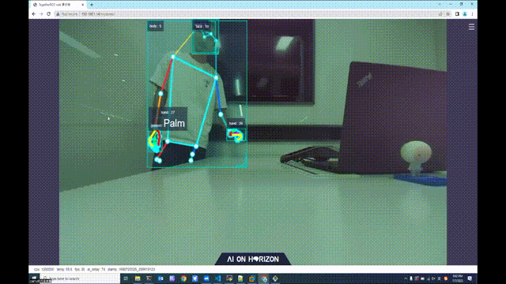

English| [简体中文](./README_cn.md)

# Function Introduction

Detect, track, and recognize hand gestures visually, generate different motion control commands based on gesture categories, and control robot movements, including left and right rotation, and forward and backward translation. This function supports two types of experiences: physical robot and Gazebo simulation.

The supported control gestures and their corresponding function definitions are as follows:
| Icon                               | Gesture        | Function Definition |
| ---------------------------------- | -------------- | -------------------- |
|    | 666 Gesture/Awesome | Forward              |
|    | Yeah/Victory   | Backward             |
|  | Thumb Right    | Right Turn           |
|  | Thumb Left     | Left Turn            |

# Physical Robot

## Bill of Materials

The following robots are all compatible with RDK X3.
| Robot Name          | Manufacturer | Reference Link                                                |
| :------------------ | ----------- | ------------------------------------------------------------- |
| OriginBot Smart Robot | Gu Yue Ju  | [Click to jump](https://www.originbot.org/)                   |
| X3 Paired Robot       | FunTech     | [Click to jump](https://item.taobao.com/item.htm?spm=a230r.1.14.17.55e556912LPGGx&id=676436236906&ns=1&abbucket=12#detail) |
| Tracked Smart Car     | Wei Xue Electronics | [Click to jump](https://detail.tmall.com/item.htm?abbucket=9&id=696078152772&rn=4d81bea40d392509d4a5153fb2c65a35&spm=a1z10.5-b-s.w4011-22714387486.159.12d33742lJtqRk) |
| RDK X3 Robot          | YahBot Intelligence | [Click to jump](https://detail.tmall.com/item.htm?id=726857243156&scene=taobao_shop&spm=a1z10.1-b-s.w5003-22651379998.21.421044e12Yqrjm) |

## Instructions on Use

### Preparation

1. The robot has a mobile base, camera, and RDK kit. The hardware is connected and tested.
2. ROS low-level driver is available, and the robot can receive `/cmd_vel` commands for movement and move correctly according to the commands.

### Robot Assembly
The following steps are based on OriginBot, and similar methods can be applied to other robots that meet the conditions. Refer to the robot's official website's [usage guide](https://www.originbot.org/guide/quick_guide/) to complete the hardware assembly, image burning, and example operation of the robot, ensuring that the basic functions of the robot can run smoothly.

### Installation of Function Packages
**1. Refer to the [OriginBot instructions](https://github.com/nodehubs/originbot_minimal/blob/develop/README.md) to complete the installation of OriginBot's basic functions.**

**2. Installation of Function Packages**

After starting the robot, connect to the robot through the terminal or VNC, and run the following commands on the RDK system to install the relevant Nodes.

tros foxy:
```bash
sudo apt update
sudo apt install -y tros-gesture-control
```

tros humble:
```bash
sudo apt update
sudo apt install -y tros-humble-gesture-control
```

### Running Gesture Control Function

**1. Start the Robot Base**Start the robot, the launch command for OriginBot is as follows:

tros foxy:
```bash
source /opt/tros/setup.bash
ros2 launch originbot_base robot.launch.py 
```

tros humble:
```bash
source /opt/tros/humble/setup.bash
ros2 launch originbot_base robot.launch.py 
```

**2. Start Gesture Control**

Launch a new terminal and start gesture control using the following commands:

tros foxy:
```shell
# Configure the tros.b environment
source /opt/tros/setup.bash

# Copy the necessary configuration files for running examples from the installation path of tros.b.
cp -r /opt/tros/${TROS_DISTRO}/lib/mono2d_body_detection/config/ .
cp -r /opt/tros/${TROS_DISTRO}/lib/hand_lmk_detection/config/ .
cp -r /opt/tros/${TROS_DISTRO}/lib/hand_gesture_detection/config/ .

# Configure the MIPI camera
export CAM_TYPE=mipi

# Run the launch file
ros2 launch gesture_control gesture_control.launch.py
```

tros humble:
```shell
# Configure the tros.b humble environment
source /opt/tros/humble/setup.bash

# Copy the necessary configuration files for running examples from the installation path of tros.b.
cp -r /opt/tros/${TROS_DISTRO}/lib/mono2d_body_detection/config/ .
cp -r /opt/tros/${TROS_DISTRO}/lib/hand_lmk_detection/config/ .
cp -r /opt/tros/${TROS_DISTRO}/lib/hand_gesture_detection/config/ .

# Configure the MIPI camera
export CAM_TYPE=mipi

# Run the launch file
ros2 launch gesture_control gesture_control.launch.py
```

Once successfully started, stand in front of the robot's camera and make sure the robot recognizes your hand gestures. Use "666/Awesome" gesture to make the robot move forward, "Yeah/Victory" gesture to make it move backward, "ThumbRight" gesture to turn the robot right, and "ThumbLeft" gesture to turn the robot left. **Note that left and right refer to the directions towards the person's left or right based on the direction of the thumb**.


**3. View Visual Recognition Results**

Open a web browser on a computer in the same network, access [http://IP:8000](http://IP:8000) to see real-time visual recognition results, where IP is the RDK's IP address.



# Gazebo Simulation

Gazebo simulation is suitable for developers who have an RDK X3 but do not have the physical robot to experience its functionality.

## Bill of Materials

| Robot Name          | Manufacturer | Reference Link                                               |
| :------------------ | ------------ | ------------------------------------------------------------ |
| RDK X3              | Multiple     | [Click to go](https://developer.d-robotics.cc/rdkx3)             |

## Instructions

### Preparatory WorkBefore experiencing, the following basic conditions are required:

- Developer has physical RDK kit and accompanying camera
- Installation of ROS Gazebo and Turtlebot robot related packages on the PC has been completed
- The PC is on the same network segment as the RDK (wired or connected to the same wireless network, the first three segments of the IP address must match). Environment packages that need to be installed on the PC side include:

tros foxy:
  - Ubuntu 20.04 system

  - [ROS2 Foxy desktop version](https://docs.ros.org/en/foxy/Installation/Ubuntu-Install-Debians.html)

  - Gazebo and Turtlebot3 related packages, installation method:

   ```shell
   sudo apt-get install ros-foxy-gazebo-*
   sudo apt install ros-foxy-turtlebot3
   sudo apt install ros-foxy-turtlebot3-simulations
   ```

tros humble:
  - Ubuntu 22.04 system

  - [ROS2 Humble desktop version](https://docs.ros.org/en/humble/Installation/Ubuntu-Install-Debians.html)

  - Gazebo and Turtlebot3 related packages, installation method:

   ```shell
   sudo apt-get install ros-humble-gazebo-*
   sudo apt install ros-humble-turtlebot3
   sudo apt install ros-humble-turtlebot3-simulations
   ```

### Installing packages

After starting RDK X3, connect to the robot via terminal or VNC, copy and run the following command on the RDK system to install the nodes related to gesture control.

tros foxy:
```bash
sudo apt update
sudo apt install -y tros-gesture-control
```

tros humble:
```bash
sudo apt update
sudo apt install -y tros-humble-gesture-control
```

### Running gesture control

**1. Start simulation environment and robot**

In the terminal of Ubuntu on the PC side, use the following command to start Gazebo and load the robot model:

tros foxy:
```bash
source /opt/ros/foxy/setup.bash
export TURTLEBOT3_MODEL=burger
ros2 launch turtlebot3_gazebo empty_world.launch.py
```

tros humble:
```bash
source /opt/ros/humble/setup.bash
export TURTLEBOT3_MODEL=burger
ros2 launch turtlebot3_gazebo empty_world.launch.py
```

Once successfully started, the effect of the car in the simulation environment is as follows:


**2. Start gesture control**

On the RDK system, start a terminal and initiate the function with the following command:

tros foxy:
```shell
# Configure the tros.b environment```
source /opt/tros/setup.bash

# Copy the configuration files required for running the example from the installation path of tros.b.
cp -r /opt/tros/${TROS_DISTRO}/lib/mono2d_body_detection/config/ .
cp -r /opt/tros/${TROS_DISTRO}/lib/hand_lmk_detection/config/ .
cp -r /opt/tros/${TROS_DISTRO}/lib/hand_gesture_detection/config/ .

# Configure MIPI camera
export CAM_TYPE=mipi

# Run the launch file
ros2 launch gesture_control gesture_control.launch.py
```

tros humble:
```shell
# Configure the tros.b humble environment```
source /opt/tros/humble/setup.bash

# Copy the configuration files required for running the example from the installation path of tros.b.
cp -r /opt/tros/${TROS_DISTRO}/lib/mono2d_body_detection/config/ .
cp -r /opt/tros/${TROS_DISTRO}/lib/hand_lmk_detection/config/ .
cp -r /opt/tros/${TROS_DISTRO}/lib/hand_gesture_detection/config/ .

# Configure MIPI camera
export CAM_TYPE=mipi

# Run the launch file
ros2 launch gesture_control gesture_control.launch.py
```

After successful startup, stand in front of the robot's camera and let the robot recognize your hand gestures. Use the following gestures to control the robot: "666 gesture/Awesome" to move the car forward, "yeah/Victory" to move the car backward, "ThumbRight" to turn the car right, and "ThumbLeft" to turn the car left. **Note: "left" and "right" refer to the left and right directions as indicated by the position of your thumb.** See the effect [here](https://developer.horizon.cc/documents_tros/apps/car_gesture_control).

**3. View Visual Recognition Results**

Open a browser on a computer connected to the same network, visit [http://IP:8000](http://IP:8000) to see real-time visual recognition results, where IP is the IP address of RDK.

# Interface Specification

## Subscribed Topics

| Name                          | Message Type                                                  | Description                                         |
| ----------------------------- | ------------------------------------------------------------ | --------------------------------------------------- |
| /hobot_hand_gesture_detection | [hobot_msgs/ai_msgs/msg/PerceptionTargets](https://github.com/D-Robotics/hobot_msgs/blob/develop/ai_msgs/msg/PerceptionTargets.msg) | Information of recognized gestures |

## Published Topics

| Name       | Message Type             | Description                              |
| ---------- | ------------------------ | ---------------------------------------- |
| /cmd_vel   | geometry_msgs/msg/Twist | Publishes velocity commands for robot movements |

## Parameters

| Parameter Name            | Type        | Description                                 | Mandatory | Supported Configurations | Default Value |
| ------------------------- | ----------- | ------------------------------------------- | --------- | -----------------------  | ------------- |
| track_serial_lost_num_thr | int         | Threshold for consecutive lost frames of target.<br>If exceeded, the target is considered lost. | No        | Unlimited                | 100           |
| activate_wakeup_gesture   | int         | Whether to enable wake-up gesture.          | No        | 0: Disabled<br>1: Enabled | 0             |
| move_step                 | float       | Linear velocity in meters per second.        | No        | Unlimited                | 0.1           |
| rotate_step               | float       | Angular velocity in radians per second.      | No        | Unlimited                | 0.5           |
| twist_pub_topic_name      | std::string | Topic name for publishing motion control messages of type Twist | No        | Configured based on deployment environment.<br>Generally, the topic subscribed by the robot is `/cmd_vel`, and in ROS2 turtlesim example, it is `turtle1/cmd_vel`. | /cmd_vel     |
| ai_msg_sub_topic_name     | std::string | Topic name for subscribing messages containing gesture recognition results | No        | Configured based on deployment environment | /hobot_hand_gesture_detection |

# Principle Overview
The functionality of controlling the robot through gestures is composed of MIPI image acquisition, human body detection and tracking, hand keypoint detection, gesture recognition, gesture control strategy, image encoding, and web display end. The workflow is shown in the following diagram:


# Reference

Gesture Control Reference: [Developer Talk | Horizon Programmer Dad Takes You on a Tour of Robot Development Platform - Episode 1 Gesture Control](https://developer.horizon.cc/forumDetail/98129540173361326) 

# Frequently Asked Questions

1. Error when running startup command under Ubuntu `-bash: ros2: command not found`

Current terminal is not set to the tros.b environment. Execute the following command to configure the environment:

tros foxy:
```
source /opt/tros/setup.bash
```

tros humble:
```
source /opt/tros/humble/setup.bash
```

Execute `ros2` command in the current terminal to confirm if the terminal environment is effective:

```
# ros2
usage: ros2 [-h] Call `ros2 <command> -h` for more detailed usage. ...

ros2 is an extensible command-line tool for ROS 2.

optional arguments:
  -h, --help            show this help message and exit
```

If the above information is output, it indicates that the ros2 environment is configured successfully.

***Note! For each newly opened terminal, the tros.b environment needs to be set again.***

2. No response from the robot when making control gestures

- Confirm if there is motion control message publishing

In the RDK system, start the terminal and use the command `ros2 topic echo /cmd_vel` to confirm if the topic message `/cmd_vel` is being published. If not, then confirm if the gesture is being detected.

- Check if the gesture is recognized

After making a control gesture, check if the value of the keyword "tracking_sta" in the output log is 1, at the same time, whether the gesture value is greater than 0. Also, check if there are gesture recognition rendering results on the computer browser, otherwise follow the example of gesture actions in the "Features Introduction" section to confirm if the gesture is standard.
