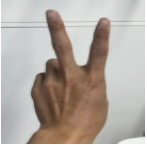
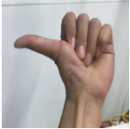

[English](./README.md) | 简体中文

# 功能介绍

通过视觉进行人手检测、跟踪和手势识别，根据手势类别生成不同运动控制指令并控制机器人运动，包括左右旋转和前后平移运动。该功能支持机器人实物和Gazebo仿真两种体验方式。

支持的控制手势和对应的功能定义如下：
| 图示                                 | 手势 | 功能定义                                                     |
| ------------------------------------ | ---- | ------------------------------------------------------------ |
|      | 666手势/Awesome   | 前进                      |
|  | Yeah/Victory | 后退 |
|  | 大拇指向右/ThumbRight | 右转 |
|  | 大拇指向左/ThumbLeft | 左转 |

# 机器人实物

## 物料清单

以下机器人均已适配RDK X3。

| 机器人名称          | 生产厂家 | 参考链接                                                     |
| :------------------ | -------- | ------------------------------------------------------------ |
| OriginBot智能机器人 | 古月居   | [点击跳转](https://www.originbot.org/)                       |
| X3派机器人          | 轮趣科技 | [点击跳转](https://item.taobao.com/item.htm?spm=a230r.1.14.17.55e556912LPGGx&id=676436236906&ns=1&abbucket=12#detail) |
| 履带智能车          | 微雪电子 | [点击跳转](https://detail.tmall.com/item.htm?abbucket=9&id=696078152772&rn=4d81bea40d392509d4a5153fb2c65a35&spm=a1z10.5-b-s.w4011-22714387486.159.12d33742lJtqRk) |
| RDK X3 Robot        | 亚博智能 | [点击跳转](https://detail.tmall.com/item.htm?id=726857243156&scene=taobao_shop&spm=a1z10.1-b-s.w5003-22651379998.21.421044e12Yqrjm) |

## 使用方法

### 准备工作

1. 机器人具备运动底盘、相机及RDK套件，硬件已经连接并测试完毕；
2. 已有ROS底层驱动，机器人可接收`/cmd_vel`指令运动，并根据指令正确运动。

### 机器人组装
以下操作过程以OriginBot为例，满足条件的其他机器人使用方法类似。参考机器人官网的[使用指引](https://www.originbot.org/guide/quick_guide/)，完成机器人的硬件组装、镜像烧写及示例运行，确认机器人的基础功能可以顺利运行。

### 安装功能包
**1.参考[OriginBot说明](https://github.com/nodehubs/originbot_minimal/blob/develop/README.md)，完成OriginBot基础功能安装**

**2.安装功能包**

启动机器人后，通过终端或者VNC连接机器人，复制如下命令在RDK的系统上运行，完成相关Node的安装。

tros foxy 版本
```bash
sudo apt update
sudo apt install -y tros-gesture-control
```

tros humble 版本
```bash
sudo apt update
sudo apt install -y tros-humble-gesture-control
```

### 运行手势控制功能

**1.启动机器人底盘**

启动机器人，如OriginBot的启动命令如下：

tros foxy 版本
```bash
source /opt/tros/setup.bash
ros2 launch originbot_base robot.launch.py 
```

tros humble 版本
```bash
source /opt/tros/humble/setup.bash
ros2 launch originbot_base robot.launch.py 
```

**2.启动手势控制**

启动一个新的终端，通过如下指令启动手势控制功能：

tros foxy 版本
```shell
# 配置tros.b环境
source /opt/tros/setup.bash

# 从tros.b的安装路径中拷贝出运行示例需要的配置文件。
cp -r /opt/tros/${TROS_DISTRO}/lib/mono2d_body_detection/config/ .
cp -r /opt/tros/${TROS_DISTRO}/lib/hand_lmk_detection/config/ .
cp -r /opt/tros/${TROS_DISTRO}/lib/hand_gesture_detection/config/ .

# 配置MIPI摄像头
export CAM_TYPE=mipi

# 运行launch文件
ros2 launch gesture_control gesture_control.launch.py
```

tros humble 版本
```shell
# 配置tros.b humble环境
source /opt/tros/humble/setup.bash

# 从tros.b的安装路径中拷贝出运行示例需要的配置文件。
cp -r /opt/tros/${TROS_DISTRO}/lib/mono2d_body_detection/config/ .
cp -r /opt/tros/${TROS_DISTRO}/lib/hand_lmk_detection/config/ .
cp -r /opt/tros/${TROS_DISTRO}/lib/hand_gesture_detection/config/ .

# 配置MIPI摄像头
export CAM_TYPE=mipi

# 运行launch文件
ros2 launch gesture_control gesture_control.launch.py
```

启动成功后，站在机器人摄像头前，需要让机器人识别到手部，通过“666手势/Awesome”手势控制小车前进，“Yeah/Victory”手势控制小车后退，“大拇指向右/ThumbRight”手势控制小车右转，“大拇指向左/ThumbLeft”手势控制小车左转。**其中左转/右转分别是向人的左/右方向（大拇指的指向）转动**。


**3.查看视觉识别效果**

打开处于同一网络下电脑的浏览器，访问[http://IP:8000](http://IP:8000)即可看到视觉识别的实时效果，其中IP为RDK的IP地址。


# Gazebo仿真

Gazebo仿真适用于持有RDK X3但没有机器人实物的开发者体验功能。

## 物料清单

| 机器人名称          | 生产厂家 | 参考链接                                                     |
| :------------------ | -------- | ------------------------------------------------------------ |
| RDK X3             | 多厂家 | [点击跳转](https://developer.d-robotics.cc/rdkx3) |

## 使用方法

### 准备工作

在体验之前，需要具备以下基本条件：

- 开发者有RDK套件实物，及配套的相机
- PC电脑端已经完成ROS Gazebo及Turtlebot机器人相关功能包安装
- 和RDK在同一网段（有线或者连接同一无线网，IP地址前三段需保持一致）的PC，PC端需要安装的环境包括：

tros foxy 版本
  - Ubuntu 20.04系统

  - [ROS2 Foxy桌面版](https://docs.ros.org/en/foxy/Installation/Ubuntu-Install-Debians.html)

  - Gazebo和Turtlebot3相关的功能包，安装方法：

   ```shell
   sudo apt-get install ros-foxy-gazebo-*
   sudo apt install ros-foxy-turtlebot3
   sudo apt install ros-foxy-turtlebot3-simulations
   ```

tros humble 版本
  - Ubuntu 22.04系统

  - [ROS2 Humble桌面版](https://docs.ros.org/en/humble/Installation/Ubuntu-Install-Debians.html)

  - Gazebo和Turtlebot3相关的功能包，安装方法：

   ```shell
   sudo apt-get install ros-humble-gazebo-*
   sudo apt install ros-humble-turtlebot3
   sudo apt install ros-humble-turtlebot3-simulations
   ```

### 安装功能包

启动RDK X3后，通过终端或者VNC连接机器人，复制如下命令在RDK的系统上运行，完成手势控制相关Node的安装。

tros foxy 版本
```bash
sudo apt update
sudo apt install -y tros-gesture-control
```

tros humble 版本
```bash
sudo apt update
sudo apt install -y tros-humble-gesture-control
```

### 运行手势控制功能

**1.启动仿真环境及机器人**

在PC端Ubuntu的终端中使用如下命令启动Gazebo，并加载机器人模型：

tros foxy 版本
```bash
source /opt/ros/foxy/setup.bash
export TURTLEBOT3_MODEL=burger
ros2 launch turtlebot3_gazebo empty_world.launch.py
```

tros humble 版本
```bash
source /opt/ros/humble/setup.bash
export TURTLEBOT3_MODEL=burger
ros2 launch turtlebot3_gazebo empty_world.launch.py
```

启动成功后，仿真环境中小车效果如下：


**2.启动手势控制**

在RDK的系统中，启动终端，通过如下指令启动功能：

tros foxy 版本
```shell
# 配置tros.b环境
source /opt/tros/setup.bash

# 从tros.b的安装路径中拷贝出运行示例需要的配置文件。
cp -r /opt/tros/${TROS_DISTRO}/lib/mono2d_body_detection/config/ .
cp -r /opt/tros/${TROS_DISTRO}/lib/hand_lmk_detection/config/ .
cp -r /opt/tros/${TROS_DISTRO}/lib/hand_gesture_detection/config/ .

# 配置MIPI摄像头
export CAM_TYPE=mipi

# 运行launch文件
ros2 launch gesture_control gesture_control.launch.py
```

tros humble 版本
```shell
# 配置tros.b humble环境
source /opt/tros/humble/setup.bash

# 从tros.b的安装路径中拷贝出运行示例需要的配置文件。
cp -r /opt/tros/${TROS_DISTRO}/lib/mono2d_body_detection/config/ .
cp -r /opt/tros/${TROS_DISTRO}/lib/hand_lmk_detection/config/ .
cp -r /opt/tros/${TROS_DISTRO}/lib/hand_gesture_detection/config/ .

# 配置MIPI摄像头
export CAM_TYPE=mipi

# 运行launch文件
ros2 launch gesture_control gesture_control.launch.py
```

启动成功后，站在机器人摄像头前，需要让机器人识别到手部，通过“666手势/Awesome”手势控制小车前进，“yeah/Victory”手势控制小车后退，“大拇指向右/ThumbRight”手势控制小车右转，“大拇指向左/ThumbLeft”手势控制小车左转。**其中左转/右转分别是向人的左/右方向（大拇指的指向）转动**，效果[点击跳转](https://developer.horizon.cc/documents_tros/apps/car_gesture_control)。

**3.查看视觉识别效果**

打开同一网络电脑的浏览器,访问[http://IP:8000](http://IP:8000)即可看到视觉识别的实时效果，其中IP为RDK的IP地址。 

# 接口说明

## 订阅话题

| 名称                          | 消息类型                                                     | 说明                                                   |
| ----------------------------- | ------------------------------------------------------------ | ------------------------------------------------------ |
| /hobot_hand_gesture_detection   | [hobot_msgs/ai_msgs/msg/PerceptionTargets](https://github.com/D-Robotics/hobot_msgs/blob/develop/ai_msgs/msg/PerceptionTargets.msg)     | 识别到的手势信息   |

## 发布话题

| 名称                          | 消息类型                                                      | 说明                                |
| ----------------------------- | ------------------------------------------------------------ | ------------------------------------------------------ |
| /cmd_vel                      | geometry_msgs/msg/Twist                                      | 发布控制机器人移动的速度指令              |

## 参数

| 参数名                    | 类型        | 解释     | 是否必须 | 支持的配置       | 默认值         |
| ------------------------ | ----------- | -------- | ------- | -------------- | -------------- | 
| track_serial_lost_num_thr | int         | 目标连续消失帧数阈值。<br>超过此阈值认为目标消失。 | 否       | 无限制                                                                                                  | 100                           |
| activate_wakeup_gesture   | int         | 是否启用唤醒手势。                             | 否       | 0：不启用<br>1：启用。                                                                               | 0                             |
| move_step                 | float       | 线速度，单位米/秒。                       | 否       | 无限制                                                                                                  | 0.1                           |
| rotate_step               | float       | 角速度，单位弧度/秒。                     | 否       | 无限制                                                                                                  | 0.5                           |
| twist_pub_topic_name      | std::string | 发布Twist类型的运动控制消息的topic名           | 否       | 根据实际部署环境配置。<br>一般机器人订阅的topic为`/cmd_vel`，ROS2 turtlesim示例订阅的topic为`turtle1/cmd_vel`。 | /cmd_vel                      |
| ai_msg_sub_topic_name     | std::string | 订阅包含手势识别结果消息的topic名          | 否       | 根据实际部署环境配置                                                                                    | /hobot_hand_gesture_detection |

# 原理简介
手势控制机器人功能由MIPI图像采集、人体检测和跟踪、人手关键点检测、手势识别、手势控制策略、图像编码、Web展示端组成，流程如下图：


# 参考资料

手势控制参考：[开发者说 | 地平线程序员奶爸带你玩转机器人开发平台 —— 第一期 手势控制](https://developer.horizon.cc/forumDetail/98129540173361326) 

# 常见问题

1. Ubuntu下运行启动命令报错`-bash: ros2: command not found`

当前终端未设置tros.b环境，执行命令配置环境：

tros foxy 版本
```
source /opt/tros/setup.bash
```

tros humble 版本
```
source /opt/tros/humble/setup.bash
```

在当前终端执行ros2命令确认当前终端环境是否生效：

```
# ros2
usage: ros2 [-h] Call `ros2 <command> -h` for more detailed usage. ...

ros2 is an extensible command-line tool for ROS 2.

optional arguments:
  -h, --help            show this help message and exit
```

如果输出以上信息，说明ros2环境配置成功。

***注意！对于每个新打开的终端，都需要重新设置tros.b环境。***

2. 做出控制手势，机器人无反应

- 确认是否有运动控制消息发布

在RDK的系统中，启动终端，使用`ros2 topic echo /cmd_vel`命令确认是否有`/cmd_vel`话题消息发布，如果无，再确认是否识别到手势。

- 检查是否识别到手势

做出控制手势后，查看输出log中“tracking_sta”关键字值是否为1，同时gesture值是否大于0，或者查看电脑浏览器上是否有手势识别渲染结果，否则按照“功能介绍”部分手势动作举例确认手势是否标准。
